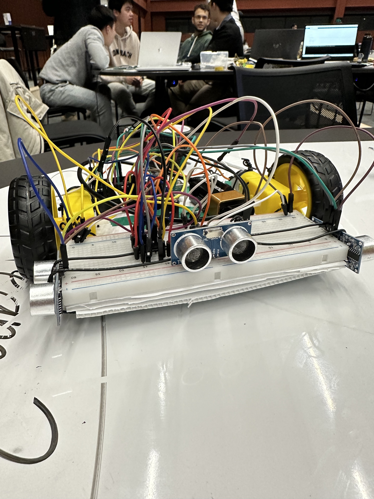

# Autonomous Maze Solving Robot

Welcome to the GitHub repository for our Autonomous Maze Solving Robot project! This project showcases the development of a robot capable of autonomously navigating through a maze using a wall-following algorithm. Below, you'll find an overview of the components used, the robot's design, and details about the software implementation.

## Components Used

- **Arduino Uno:** The central control unit responsible for processing sensor data and managing motor actions.
- **2 TT Motors with Wheels:** These motors provide the robot's mobility, enabling precise movement and turns.
- **3 Ultrasonic Sensors (HC-SR04):** Positioned on the left, right, and front sides, these sensors detect obstacles and walls.
- **Colour Sensor (TCS230 TCS3200):** Located underneath the robot, this sensor identifies different colors or markings on the maze floor.
- **L293 Motor Driver:** Facilitates motor control and smooth maneuvering.
- **Breadboard:** Serves as a platform for connecting and prototyping electronic components.
- **Corrugated Plastic Sheet:** The robot's stable base, supporting all components securely.

## Design

Our robot features a well-thought-out design to ensure efficient performance:

- **Motor Placement:** Dual TT motors on either side provide balanced movement and stability.
- **Ultrasonic Sensors:** HC-SR04 sensors on the left, right, and front detect walls, enabling navigation decisions.
- **Colour Sensor:** The TCS230 TCS3200 sensor beneath the robot identifies colors on the maze floor.

## Software Implementation

   

The robot's software is programmed into the Arduino Uno using a cable connection. The core of our solution is a wall-following algorithm:

- **Intersection Handling:** When reaching an intersection, the robot prioritizes a left turn. If not feasible, it attempts to move straight. When straight is blocked, it turns right.
- **Non-Intersection Movement:** Outside intersections, the robot proceeds forward.

## Conclusion

Our Autonomous Maze Solving Robot project demonstrates the integration of hardware and software, resulting in an intelligent robot navigating mazes autonomously. We hope this repository proves valuable to those interested in robotics and autonomous systems.

*Authors: Yusuke Miyashita, Avvienash Jaganathan, Ngoc Luu, Shu-An Lin*
